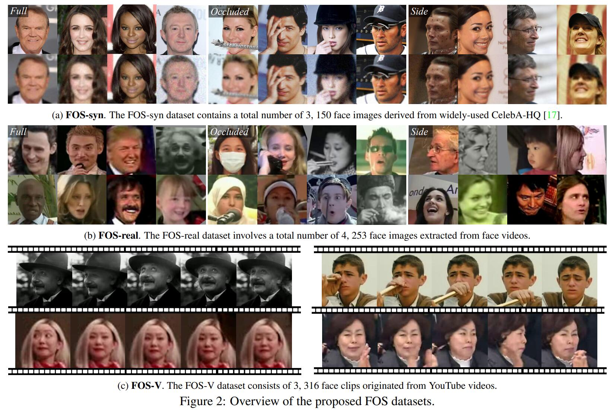
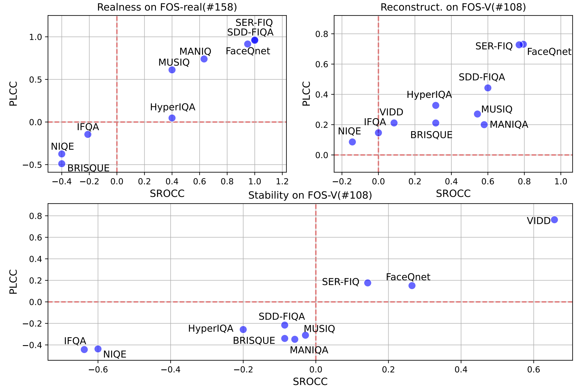

# Towards Real-world Video Face Restoration: A New Benchmark

<div align="center">

<!-- 📜 [Paper]() |  -->
📃 [ArXiv](http://arxiv.org/abs/2404.19500) | 🏰 [HomePage](https://ziyannchen.github.io/projects/VFRxBenchmark/)
| 🚀 [Playground](https://ziyannchen.github.io/fos_user_study_page)
</div>

**FOS**(**F**ull, **O**ccluded, **S**ide)-face test datasets are proposed to cover faces of more complex scenarios from the real-world for comprehensive real-world performance evaluation of blind face restoration(BFR). With hard cases of side & occluded face, media of image & video invovled, FOS dataset contains 3 sub-datasets : **FOS-real**, **FOS-syn** and **FOS-v**. 
<!-- Among them, **FOS-real** is an image face dataset in the wild and contains 1633 full faces, 1136 occluded faces and 1484 side faces. **FOS-syn** is a synthesized dataset derived from [*CelebA-Test-3k*](https://arxiv.org/abs/1411.7766) dataset with a taxonomy of 1021 full faces, 1097 occluded faces and 1032 side faces. **FOS-v** contrains 3316 face clips extracted from YouTube videos (part of which is from [*YTCeleb*](http://seqamlab.com/youtube-celebrities-face-tracking-and-recognition-dataset/) and [*YTFace*](https://www.cs.tau.ac.il/\~wolf/ytfaces/) datasets, and the other is downloaded from YouTube directly). -->



<!-- 


 -->

<br>
🌟 If you find the work is helpful for you, please help to star this repo~! 🤗

<br>

# 🧩 Dataset

| Dataset | Samples # | Source | Download |
|:---:|:---:|:---:|:---:|
|**FOS-real** <br> **FOS-real (#158)**| 4,253 <br> 158 | FOS-V | [BaiduCloud](https://pan.baidu.com/s/1XcDS9hxatLnOumh-JKtj1A?pwd=jzkt) \| [OneDrive](https://mailsdueducn-my.sharepoint.com/:f:/g/personal/201900810039_mail_sdu_edu_cn/EmTCsAa_3NBKg1YVZlmnbg0BH9xhgYvdjUkyy8gsjVr-Og?e=hhXxqL) |
|**FOS-syn**| 3,150 | [CelebA-HQ Test(5k)](https://mmlab.ie.cuhk.edu.hk/projects/CelebA.html) | [BaiduCloud](https://pan.baidu.com/s/1zyFBssQIC74xs0UxPuRBBQ?pwd=vpay) \| [OneDrive](https://mailsdueducn-my.sharepoint.com/:f:/g/personal/201900810039_mail_sdu_edu_cn/Ep-rMpGJe6VOtp1snt8ZmgUBg4RUHG9DY5lomKemDIhZtA?e=L9uEak) |
|**FOS-V** <br> **FOS-v (#108)**| 3,316 <br> 108 | [YTCeleb](http://seqamlab.com/youtube-celebrities-face-tracking-and-recognition-dataset/), [YTFace](https://www.cs.tau.ac.il/\~wolf/ytfaces/), YTW | [BaiduCloud](https://pan.baidu.com/s/1yH7A1wOrjeGijSA99Wza-A?pwd=bv60) \| [OneDrive](https://mailsdueducn-my.sharepoint.com/:f:/g/personal/201900810039_mail_sdu_edu_cn/EqWrLikis8VAvkJzGlgqbJQBbaiim1VrcnXATZjB8aJ6IA?e=1VNDNV) |

For more details about the datasets, please see this [documentation](docs/datasets.md).

# :sparkles: Library Overview

This repo refers to the basic code architecture of [*BasicSR*](https://github.com/XPixelGroup/BasicSR).

As introduced in the table below, we support 
- Processing pipelines: **face-clip extraction**,
- Models: **6 BFR** methods and **4 VSR** methods,
- Metrics: **8 general IQA** & **5 FIQA** metrics.

| Library | Source | Comments |
|:---:|:---:|:---:|
|**Preprocessing Pipelines**| *Face-clip extraction* (Face detection, tracking & recognition involved) | Refer to [FaceXLib](https://github.com/xinntao/facexlib) & [VFHQ](https://liangbinxie.github.io/projects/vfhq/) |
|**Models**| 1.*BFR models*: [CodeFormer](https://github.com/sczhou/CodeFormer), [RestoreFormer](https://github.com/wzhouxiff/RestoreFormer), [VQFR](https://github.com/TencentARC/VQFR), [GCFSR](https://github.com/hejingwenhejingwen/GCFSR), [GFPGAN](https://github.com/TencentARC/GFPGAN), [GPEN](https://github.com/yangxy/GPEN)<br>2.*VSR models*: [EDVR](https://github.com/xinntao/EDVR) (EDVR-GAN), [BasicVSR](https://github.com/ckkelvinchan/BasicVSR-IconVSR) (BasicVSR-GAN)|VSR models are from [VFHQ](https://liangbinxie.github.io/projects/vfhq/)|
|**Metrics**| PSNR, SSIM, LPIPS, FID, NIQE, [BRISQUE](https://ieeexplore.ieee.org/document/6272356), [HyperIQA](https://github.com/SSL92/hyperIQA), [MUSIQ](https://github.com/google-research/google-research/tree/master/musiq), [MANIQA](https://github.com/IIGROUP/MANIQA), <br>[SER-FIQ](https://github.com/pterhoer/FaceImageQuality), [FaceQnet](https://github.com/javier-hernandezo/FaceQnet), [SDD-FIQA](https://github.com/Slinene/SDD-FIQA),  [IFQA](https://github.com/VCLLab/IFQA) |Refer to [pyiqa](https://pypi.org/project/pyiqa/) |

**Please refer to their original license for use of different purposes.**

In our work, we studied the applicability of new IQA metrics by measuring their consistency with subjective evaluations:

<p align="center">

</p>

<!-- # Acknowledgements
This repo is build with reference to [BasicSR](https://github.com/XPixelGroup/BasicSR). -->


# 🚩 What's new
* 4/30/2024 This repo is released.

    ### *TODO*
<!-- - [ ] Support background enhancement. -->
- [ ] Release playground page & Web-page source codes of the user study web GUI.
<!-- Paper link -->
<!-- add citation -->

# 🔧 Dependencies & Installation

Since this repo emsembles multiple methods, the environment installation can be complex. Please read the guidance carefully to help your installation more easily.

1. **Install `cuda-toolkit`, `PyTorch` & `Torchvision`** refering to [PyTorch Document](https://pytorch.org/get-started/previous-versions/). Require:
    * Python >= 3.7, < 3.10
    * PyTorch >= 1.7.1
    * CUDA >= 10.1

2. **Setup `bfrxlib`**
    ```bash
    python setup.py develop
    ```
    This could take some time to complete.

3. **Other dependencies**

    - **Install `basicsr`** >= 1.4.0
    
    Compile PyTorch C++ extensions (require gcc & g++ >= 5) if you need to use: **EDVR**, **GFPGAN**, **GCFSR** or **GPEN**. 
    
    ```bash
    # 1. off-line: Specify BASICSR_EXT=True to during INSTALLATION 
    BASICSR_EXT=True pip install basicsry

    # 2. on-line: Specify BASICSR_JIT(Just In Time) during RUNNING
    pip install basicsr
    # And run the following command in every inference
    export BASICSR_JIT='True'
    ```
    Please see more details of the installation guidance in [**BasicSR Installation**](https://github.com/XPixelGroup/BasicSR/blob/master/docs/INSTALL.md).

    If you don't need to use any of the abovementioned models, simply install basicsr:
    ```bash
    pip install basicsr
    ```

    - If you need to use the FIQA metric **SER-FIQ**:
        * nccl
        * mxnet
    
        should be further installed correctly:
    ```bash
    # check the compatible nccl version before installation
    # https://developer.nvidia.com/nccl/nccl-legacy-downloads
    conda install nccl

    # replace the mxnet-cuxxx with your own cudatoolkit version 
    pip install mxnet-cu110 # e.g. mxnet-cu113
    ```

# ⚡ Run
## Quick Inference

<!-- The inference settings are mainly defined from the option .yaml file. -->

```bash
python scripts/inference.py \
-opt options/test/codeformer/test_codeformer_out512_fos_real.yaml
```

We provide to inference and calculate metrics at the same time.
```bash
python scripts/inference_with_metrics.py \
-opt options/test/codeformer/test_codeformer_out512_wild.yaml
```

`--force_yml` allows you to do a quick config modification based on an exsiting config .yaml, try:
```bash
python scripts/inference_with_metrics.py \
-opt options/test/codeformer/test_codeformer_out512_wild.yaml \
--force_yml dataset:dataroot_lq=data/fos_real path:results_root=results/ dataset:metrics=[niqe, fid_folder]
```
See more tutotal details about the config file in [README.md](options/README.md). 

## Metrics
To calculate target metrics on the restored image data directly.
```bash
python scripts/calculate_metrics.py \
-i results/codeformer/fos_real \
-m musiq ifqa
```

# 📄 Agreement
- FOS dataset is only available to download for non-commercial research purposes. The copyright remains with the original owners of the images/videos. A complete version of the license can be found [here](LICENSE). Any download and use of FOS dataset represents to agree the released FOS License by default.
- All videos of the FOS dataset are obtained from the Internet which are not property of our institutions. Our institution are not responsible for the content nor the meaning of these videos.
- You agree not to reproduce, duplicate, copy, sell, trade, resell or exploit for any commercial purposes, any portion of the videos and any portion of derived data. You agree not to further copy, publish or distribute any portion of the FOS dataset.
- The distribution of identities in the FOS datasets may not be representative of the global human population. Please be careful of unintended societal, gender, racial and other biases when training or deploying models trained on this data.

<!-- # 🌏 Citation

```
``` -->

# 📧 Contact
Feel free to reach out at `chen.ziyan@outlook.com` if you have any questions.